# 光栅化过程

光栅化的整个过程主要包括四个阶段

1. Modeling/World Transformation - 世界变换
   - 将模型从自己的模型坐标空间变换到世界坐标空间中。
2. View/Camera Transformation - 摄像机变换
   - 将模型变换到摄像机空间中，另外一种等价的说法是将摄像机变换到世界坐标原点。
3. Screen Transformation - 屏幕空间变换-**如果是透视投影的话**
   - 将摄像机坐标系下的模型变换到透视空间( perspective volume)中。
4.  Projection  Transformation - 投影变换
   - 将上一个坐标空间中的模型变换到一个x,y坐标在[-1,1] 范围内的空间，这个空间叫做NDC空间(归一化设备坐标空间)
   - 投影变换分为两种一种是正交投影，一种是透视投影。
5. ViewPort/Windowing Transformation - 视口变换
   - 将在NDC坐标空间中的模型变换到具体的像素坐标当中。

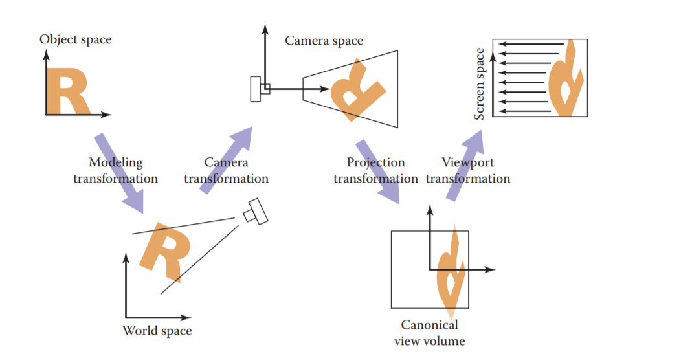

------
## 变换中坐标空间

**世界坐标系 **
游戏世界的原点，通常原点位置在(0,0,0),x,y,z的取值可以任意。

**摄像机坐标系**
以摄像机的位置作为坐标的原点，并在其原点上构建出u,v,w三个坐标系的基，x,y,z的取值是任意的。

**透视空间()**和**正交空间( orthographic view volume)**
透视空间()和正交空间( orthographic view volume)都是一个长方体的空间，通过摄像机视锥体的l,r,t,b,n,f来定义这个长方体。坐标范围不能超过这个长方体，不同在于正交空间是不用进行拉伸，而透视空间是视锥体经过拉伸后得到的。

**NDC坐标(归一化设备坐标)/规范视域体(canonical view volume)** 
是一个正方体，长度是2，或者是1,里面的坐标范围是[-1,1]或者是[0,1]。

**像素空间**
实质上就是屏幕或者是一个窗口中的像素所形成的一个二维坐标系。原点一般来说在屏幕的左上角。

------
## 正交投影和透视投影

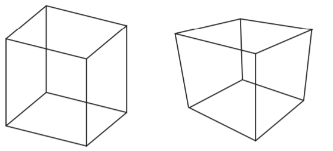
上图中绘制的是两个同样的正方体，左边是正交投影的作用效果，右边的是透视投影的作用效果。可以发现他们有一个很重要的区别就是透视投影会发生一个近大远小的现象。

在透视投影的作用下远处的边变的更小了，这会导致本来应该永不相交的两条平行的边变的不平行了。

** 正交投影和透视投影的投影过程 **
- 正交投影     模型坐标系 --> 世界坐标系 --> 摄像机坐标系 --> NDC坐标(归一化设备坐标)/规范视域体(canonical view volume) --> 像素空间/光栅空间
- 透视投影    模型坐标系 --> 世界坐标系 --> 摄像机坐标系 --> 屏幕空间 --> NDC坐标(归一化设备坐标)/规范视域体(canonical view volume) --> 像素空间/光栅空间

------

## 视口变换
无论是正交投影还是透视投影都存在视口变换，视口变换的作用是将在**NDC坐标(归一化设备坐标)/规范视域体(canonical view volume)**中的模型变换到具体的屏幕/像素空间当中。

**变换公式**
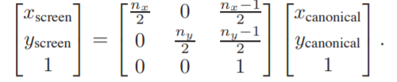

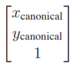 为在**NDC坐标(归一化设备坐标)/规范视域体(canonical view volume)** 中的点，在**NDC坐标(归一化设备坐标)/规范视域体(canonical view volume)** 中的点的x,y的范围是 [-1,1]/[0,1]（本文档中默认都是在[-1,1]中）

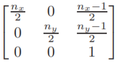 为在**视口变换矩阵** ,记作Mvp

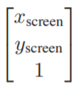 为在**屏幕空间中的点** 

**三维形式 **
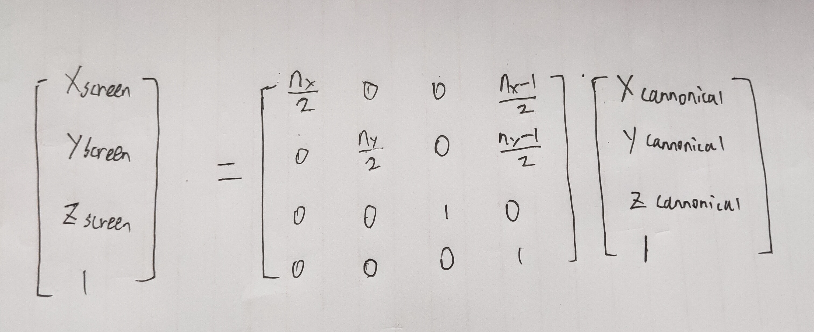

------
## 摄像机变换
无论是正交投影还是透视投影都存在摄像机变换,它的作用是将模型变换到**摄像机空间**中，摄像机变换的矩阵记作**Mcam**

图形学中定义一个摄像机是通过，定义 **e** 摄像机的位置，**g** 摄像机的朝向，**t** 摄像机的上方，这三个向量来进行定义的。然后再通过这三个向量来计算出摄像机的坐标系的基 **u,v,w**。

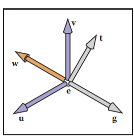 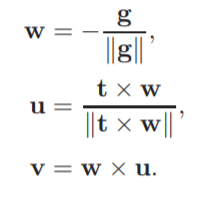

假设我们有在摄像机坐标系中的点A(a,b,c)，且知道摄像机坐标系的基在世界坐标中的表示 u,v,w三个向量和摄像机距离世界坐标系原点的向量e。**那么将这个点从摄像机坐标系转换到世界坐标系的矩阵为**
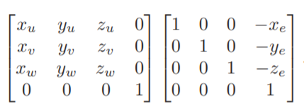
**对上述矩阵求逆后的结果就是我们想要的将世界坐标系的点转换到摄像机坐标系的矩阵Mcame**

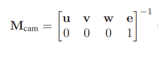

------

## 正交投影变换

正交投影的作用就是将**摄像机坐标系**中的模型变换到NDC坐标空间中**NDC坐标(归一化设备坐标)/规范视域体(canonical view volume)**中。正交投影中正交矩阵记作Morth

正交投影与透视投影的不同在于正交投影是将一个长方体内的模型变换到NDC，而透视投影是将一个视锥体内的模型变换到NDC。
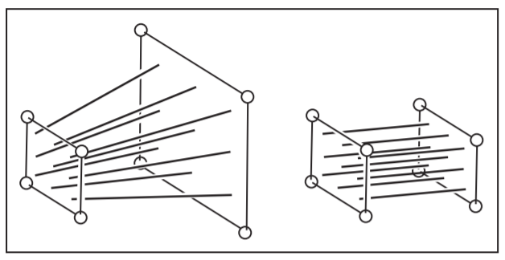

我们通过l,r,b,t,n,f 这六个数值来表示正交投影的长方体，分别表示左平面，右平面，上平面，下平面，近平面，远平面。
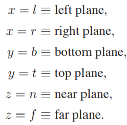

**正交矩阵**
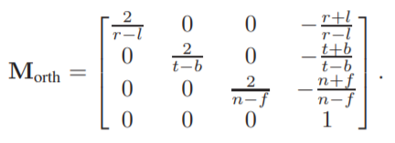
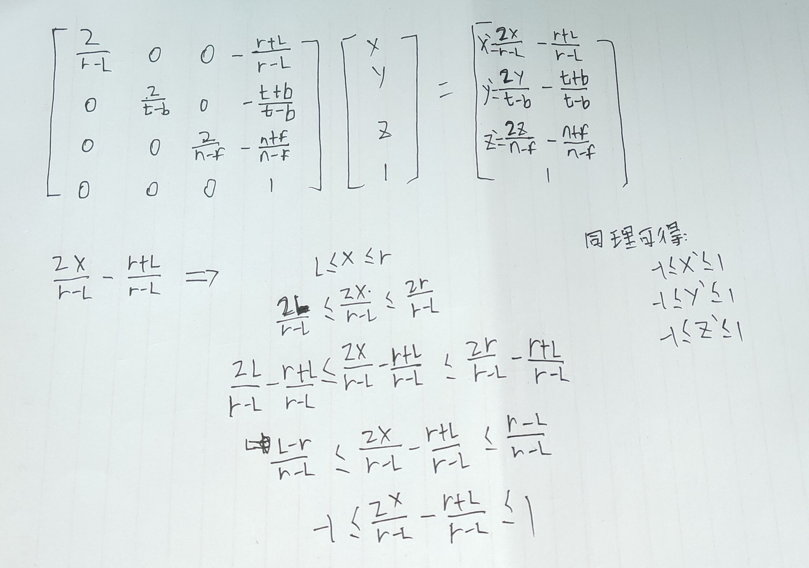

------

## 正交投影的矩阵作用过程

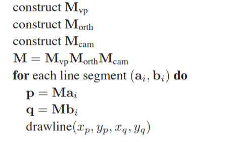

------

## 透视投影变换
透视投影变换的作用是将**摄像机空间**中的模型变换到**透视空间( perspective volume)**中，透视投影矩阵记作**P**。

透视投影和正交投影的区别是透视投影是将一个视锥体内的模型变换到NDC,而正交投影是将一个长方体内的模型变换到NDC.如下图所示。

我们可以将透视投影的过程想象成将一个视锥体拉伸成一个长度为2的正方体的过程。但是从数学上来说就是求一个相似三角形的过程，如下图所示。
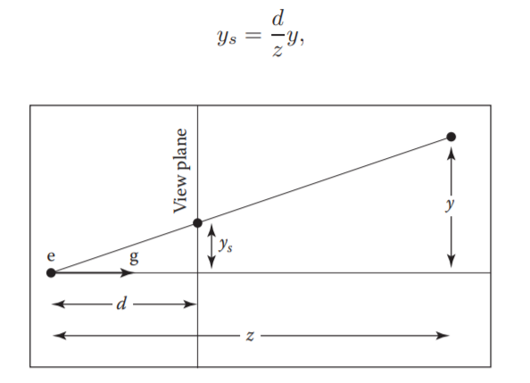

**透视投影矩阵**
我们定义n,f分别表示近平面和远平面.投影矩阵**P**如下所示，
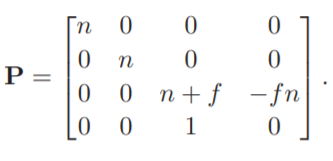
推导过程为
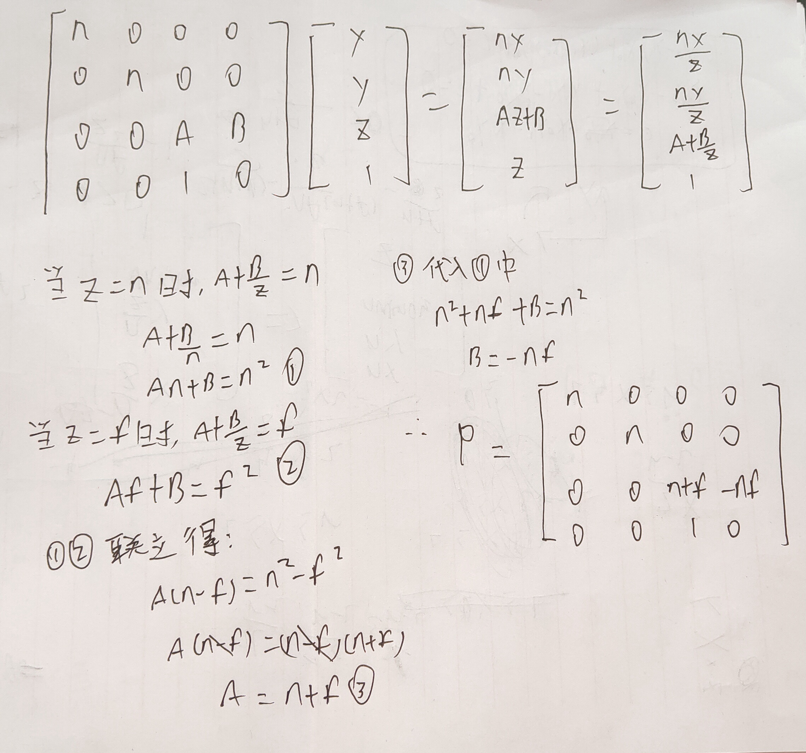

------

## 透视投影的作用过程

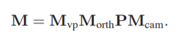
其中我们可以将**M**orth矩阵和**P**矩阵合并成一个新的矩阵**M**per
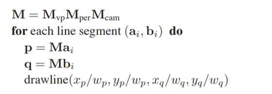