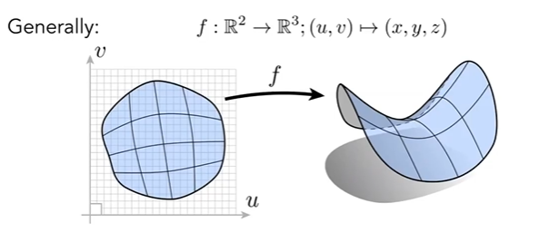
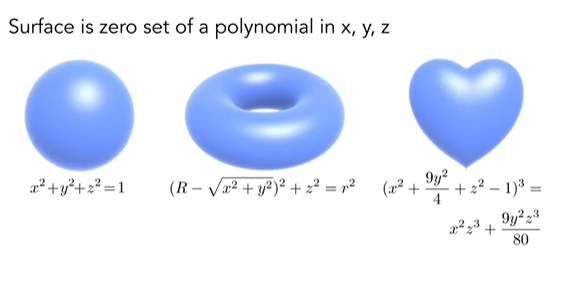
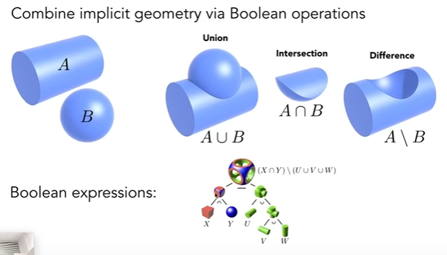
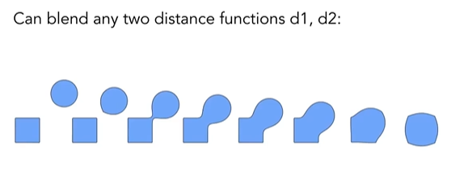
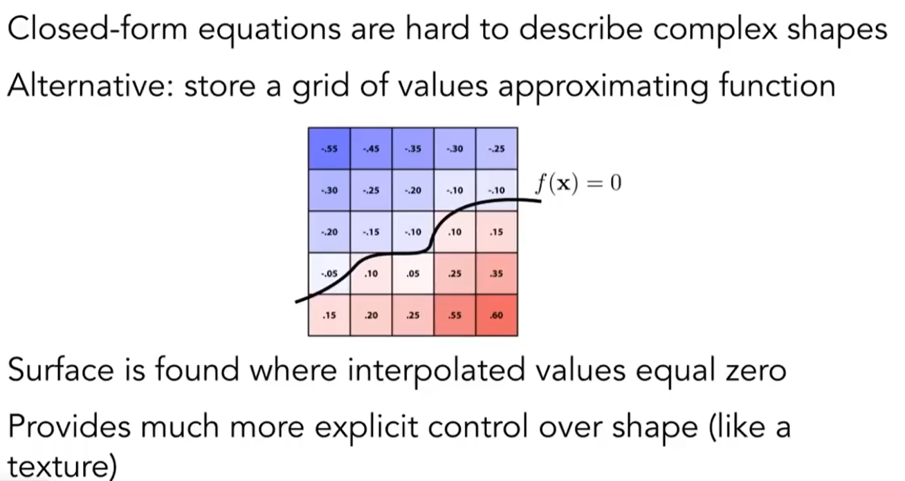
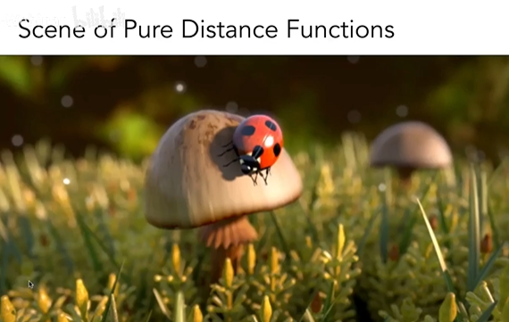
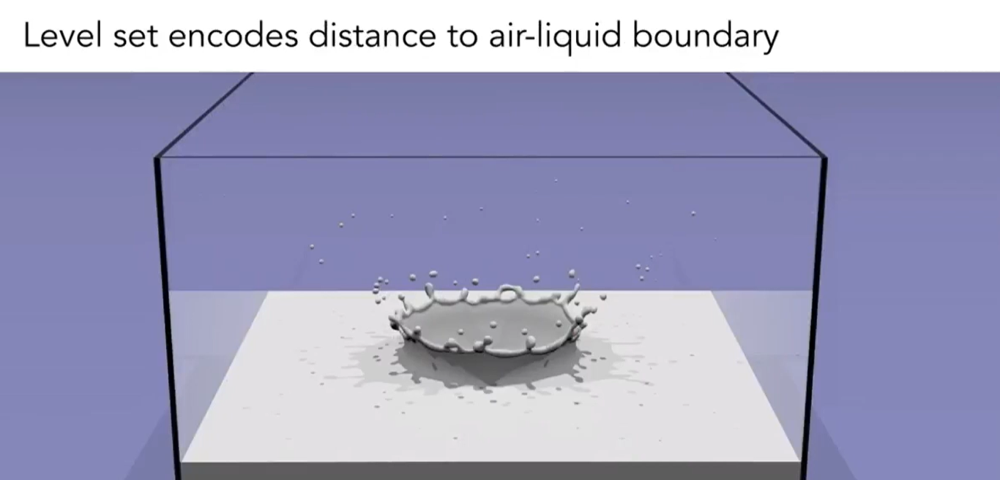
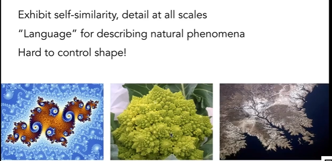

# 几何
图形学中有两种几何形式
- 隐式几何：不会直接给出点位置，而是给出点满足的关系(函数)。
	- 缺点：无法简单的获取几何上的点
	- 优点：可以简单的判断一个点是否在几何上。	 
- 显示几何：直接给出几何的所有的点，或者是通过参数映射(parameter mapping，如下图所示，将一个集合中的点映射到另外一个集合)

	- 优点：简单获取几何上的点
	- 缺点：判断一个点是否在几何上很困难

## 隐式几何的表示方法

### 代数表面(Algebraic Surfaces)

### Constructive Solid Geometyr 
通过对一些几何体进行布尔运算来构造几何体(可以写出对应的操作表达式)，类似于一些建模软件中的操作。如下图所示。

### 距离函数(Distance Functions)
可以用来模拟一些很复杂的物体融合效果例如水滴在飞溅过程中的融合。
一个距离函数是指空间中的一个点到一个几何物体边界的一个最小距离，这个距离有正负。正表示点在几何物体外部，负表示点在几何物体的内部。
通过算出两个几何物体的距离函数(SDF)，然后将两个距离函数进行一个Blend混合，再将混合后的函数转换为具体的几何物体。

#### 如何算出一个物体的距离函数呢？
使用一个确切的三维函数来表示一个物体的距离函数不太现实，所有一般我们会使用一种叫做水平集(Level Set)的方式来表示一个物体的距离函数，距离函数中值为零的就表示该物体的表面。这个水平集可以是一个二维的纹理或者是三维的纹理。

距离函数的例子

### 分形(Fractals)
一种自然现象，是一种"自我模仿"方式和计算机中的递归有相似的原理。

### 隐式几何的优缺点
优点
 - 简单的描述一个几何体，利于存储。
 - 可以很方便的还查询(内外测试)
 - 可以简单地进行相交测试
 - 对于简单的图形，不会出现采样错误
 - 可以容易的描述一些平滑过程的表面。
缺点：
- 很难构造复杂的几何体

