# GAMES101-计算机图形学课程

## 1.数学知识回顾

**集合**

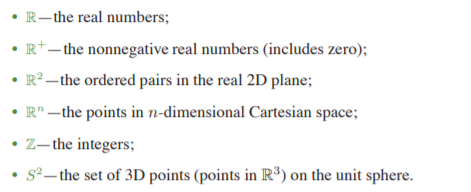

**映射**
$$
f: \mathbb{R} \mapsto	\mathbb{z}
$$
f被称为一个映射或者是函数，它表达的意思是函数取一个实数作为输入，然后输出一个整数作为结果。

箭头左边的R被称为函数的 **domain**，箭头的右边被称为函数的**target**。f(a) 被称为 **the image of a** (a为R中的元素)，R中所有元素的f(a)，被称为 **the range of function**。

**逆映射**

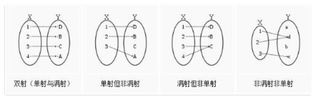

单射：单射就是集合之间元素的映射只能一对一，不能多对一。

满射：满射就是集合中所有的元素都有映射关系。

双射：双射就是即是单射又是满射。

只要函数或者映射满足单射就会存在逆映射/反函数。或者是函数/映射在某个定义域内满足单射条件那么在这个定义域内就存在反函数/逆映射。

**集合运算**

交，并，差。

**对数运算**

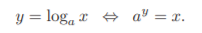

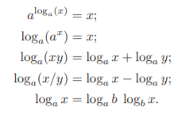

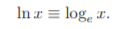

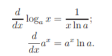

**求解二次方程**

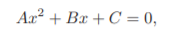

求解公式

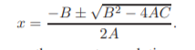

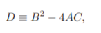

当D>0的时候有两个解，当D==0时有一个解，当D<0是无解。

**三角学**

弧度：弧度其实是指半径为1的圆的弧的长度。2Π在数值上实际上为一个半径为1的圆的周长。

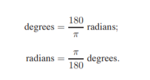

**三角函数**

勾股定理

任意三角形的面积公式

triangle area = 1/2*（向量1）*X（向量2）使用叉乘来计算三角形的面积。

**向量点乘和叉乘**

点乘

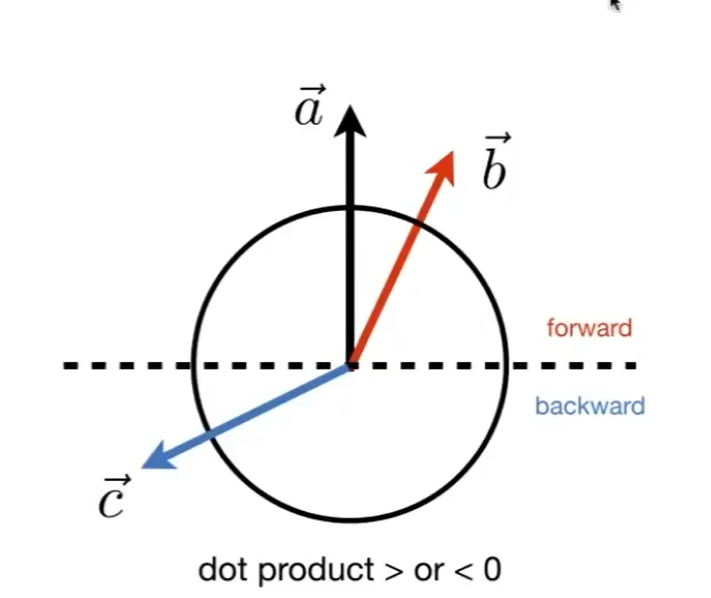

点乘的作用：

1. 测量两个向量有多接近。点乘的值越接近1表示两个向量越接近。点乘的值越接近-1表示两个向量越远离。
2. 分解一个向量。如下所示，通过点乘可以将向量b分解成红色的两个向量。

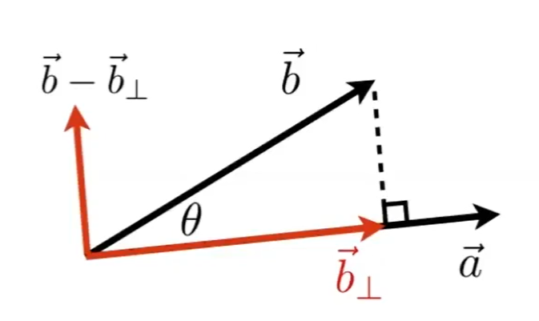

叉乘

向量叉乘的方向需要结合坐标系的种类来进行判断，如果是左手坐标系则使用左手法则，否则使用右手法则。

叉乘的作用

1. 构建坐标系。
2. 计算两个向量所组成的三角形的面积。
3. 一个向量是在另外一个向量的左边还是右边。
4. 判断一个点是否在三角形的内部。

向量投影

向量a在向量b上的投影公式如下所示。

**构造坐标系的基向量**

使用单个向量a来构造坐标系的基向量，向量w是a的单位化，向量t是任意求得的垂直于向量a的向量。

使用两个向量a和向量b来构建坐标系的基向量。当a和b共线时退化上用单个向量构造坐标系的基向量。

**曲线和表面**

隐式方程

所谓的隐式方程就是指在曲线上的点无法被立马的计算出来，相反必须通过解隐式方程才能求出曲面上的点的方程被叫做隐式方程。例如圆 的方程(x'2 + y'2 = r'2)。非隐式方程例如(y = 2x)。

输入一个点，输出一个值。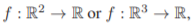

特点

- 泛用性强，可以很简单的和其他的方程进行联合。从而组合出一个新的方程。
- 可读性比较弱，有时候难以理解具体的含义。
- 无法立刻的获取点，需要对输入的点进行判断。

2D隐式曲线

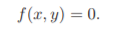

当f>0时，点在曲线的外面，当f = 0时，点在曲线上，当f<0时，点在曲线的内部。

3D 隐式表面

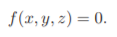

**法线 - 梯度向量**

2D曲线的法线
设有函数为 

任意一点的法线为

其中表示对x的偏导数，表示对y的偏导数。

梯度向量的作用

1. 表示函数在某一点处，函数变化速度最块的方向。
2. 表示函数的法线方向。(在三维空间中的曲面也适用)

3D 表面的法线

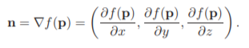

其中

1. n表示法线，计算出来的法线的方向指向f(p)>0的方向。
2. P表示一个三维向量。
3. 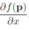表示f对x的偏微分。
4. 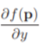表示f对y的偏微分。
5. 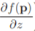表示f对z的偏微分。

**2D隐式直线**

方程：

1. 点斜式 y = mx + b。
   1. 当直线垂直于x轴的时候m的值为无穷大无法很好的表示
2. 一般式 Ax + By + C = 0。
   1. 需要使用三个点才能求出A，B，C三个参数
3. 使用梯度向量来优化 (y0 − y1)x + (x1 − x0)y + x0y1 − x1y0 = 0。
   1. 使用两个点就可以求出A，B，C三个参数，并且可以很好的表示各种直线，可以方便的求出任意一个点到直线的距离，向量(A,B)其实就是直线的梯度向量也是这条直线的法线。如下图所示。

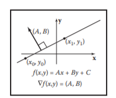

​				点到直线的距离

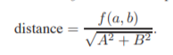

**隐式二次曲线**

隐式二次曲线有椭圆和双曲线，以及它们的特殊情况圆，抛物线等等。

一般式：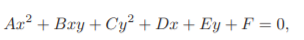

椭圆的隐式方程

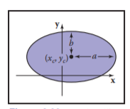

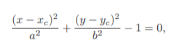

**隐式平面**

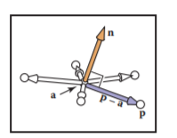

使用平面的一点a和平面法线n来表示：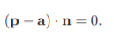

使用平面的三个点a,b,c来进行表示：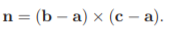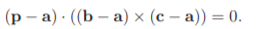

使用行列式来进行表示: 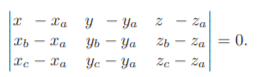

**3D二次表面**

3D空间中的二次表面有许多，比如椭圆体和球体

球体的表面方程: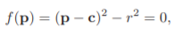 p表示未知点，c表示球体的中心点。r表示球体的半径。

轴对称的椭圆体: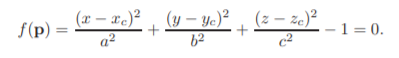a,b,c 分别对应x,y,z轴的垂直距离。(xc,yc,zc)表示椭圆中心。

**参数方程**

使用几个参数来表示一个曲线或者是表面的所有点。

输入几个参数，输出一个点。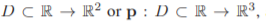 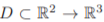

好处

- 对于参数方程来说可以直接通过几个参数来获取一个曲线或者表面上的点。
- 可以将参数跟其他的一些的概念进行绑定例如，时间，角度。等等来创造一些效果。
- 并且有时候可以很直观的进行理解。方便程序的i编写和调试。

2D参数曲线

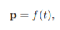

3D参数曲线

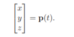

3D参数表面

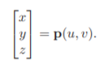

**2D参数直线**

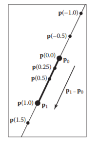

方程：

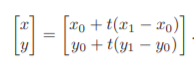 

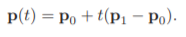

p1，p0 为直线的两个端点，当(p1 - p0) 进行单位化的时候，t就直接表示线段的长度。

2D参数圆

  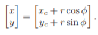 (xc,yc)为中心点，r为半径，为参数取值范围在[0,2Π]

2D参数椭圆

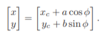(xc,yc)为中心点，r为半径，为参数取值范围在[0,2Π]

三角形重心坐标的计算方式

- 使用直线的隐式方程来进行求解
- 使用三角形的面积比值来进行求解。
  - 使用叉乘
  - 使用法向量

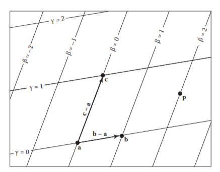

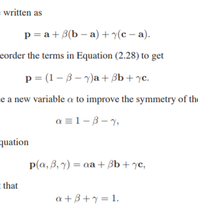

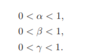

**矩阵**

矩阵的基本运算

- 加法
- 乘法 - 要符合行列的限制。
- 转置 
- 取逆 - 矩阵必须为方阵。
- 行列式 - 矩阵必须为方阵。
- 特征值 向量 

  -  跟矩阵相乘后方向不会改变的向量。
  - 不是左右矩阵都有特征向量。
- 特征值 

  - 特征向量在相乘后长度的变化比例。
- 对称矩阵的特征值分解。

  - 对称矩阵的特征值分解和非堆成矩阵的特征值分解。
  - 将对称矩阵分解成更加简单的矩阵。
- 非对称矩阵的特征值分解 - 奇异值分解(SVD)
  -  对非对称矩阵的特征值分解和非堆成矩阵的特征值分解。
  -  将非对称矩阵分解成更加简单的矩阵。

  

  

  

矩阵的种类

- 对角矩阵 
  - 除了对角线上的元素，其余元素都为零。
- 对称矩阵 
  - 矩阵转置和未转置相等。
- 正交矩阵 - 
  - 且行列式的值为 1，或 -1.
  - 矩阵中每一个行/列向量长度为1，且都互相垂直。
  - 转置就是矩阵的逆

**图形学中的变换**

线性变换

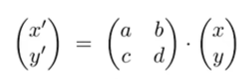

仿射变换

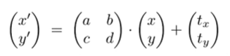

变换种类
- 缩放
  - 均匀缩放
  - 非均匀缩放。
  - 对称
- 切变
- 旋转
- 平移

**图形学中的四元数**

四元数是用来进行物体旋转变换的，它与旋转矩阵的作用都是用来进行物体旋转的。四元数的优点主要有两点

- 和矩阵的存储相比，存储四元数所需的空间更小节省了内存空间。
- 四元数可以来进行旋转的插值。