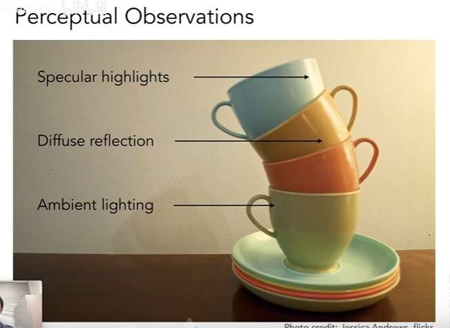
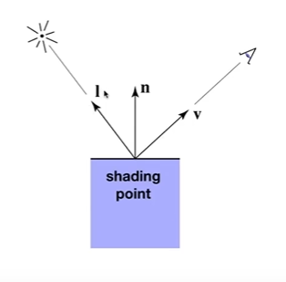
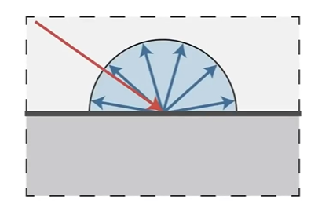
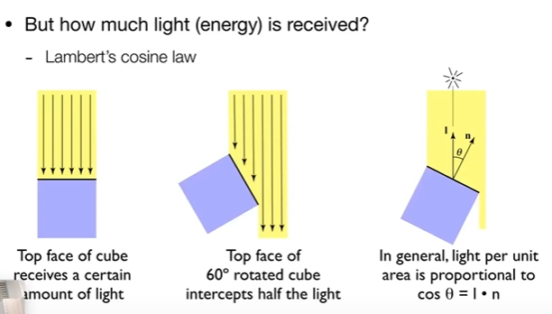
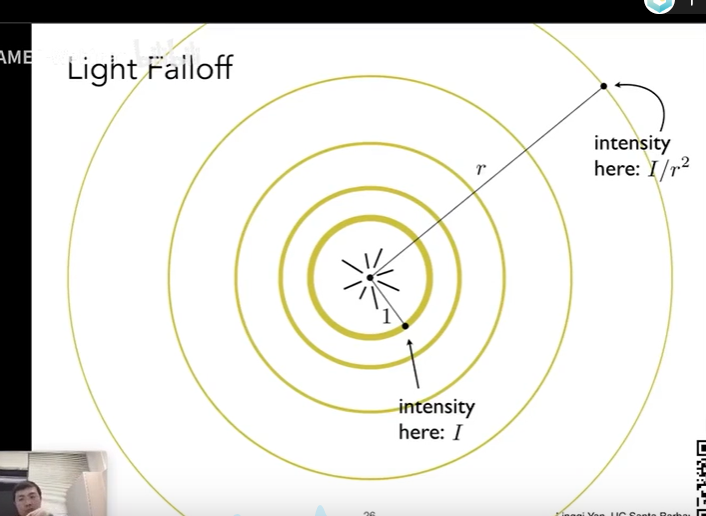
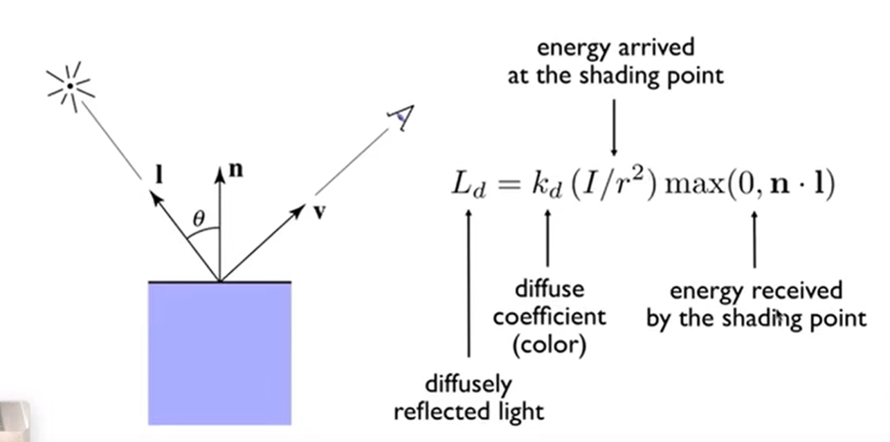

# 着色

一个物体可能受到的光照类型
- 环境照明 Ambient Lighting
- 高光 Specular highlights
- 漫反射 Diffuse reflectoin
- 镜面反射 Specular reflection

在计算着色之前我们需要定义几个变量。
- 着色点 sharding point
- 观察方向 Viewer Direction
- 表面法线 sufface normal
- 光照方向 light direction
- 表面参数 surface parameters（着色点的颜色，等等属性）

## 光照模型
- 局部光照模型-只考虑物体自己的，不考虑其他物体
- 全局光照模型- 考虑其他物体

## Phong 着色模型

### 漫反射

漫反射的特点是它会均匀的向各个方向上反射光线，如下图所示。

在介绍漫反射光的计算公式之前我们先来考虑几个问题。
**着色点从入射进来的光中吸收了多少能量**
- 物体接收到的光的能量是否和光线照射的角度相关？
我们假设有一定数量的光线以不同的角度照射到物体上如下图所示。可以明显的发现随着光线的入射方向和表面的法线方向的夹角越来越大物体接收到的光线数量越来越少，呈现出余弦函数的变化规律。

- 物体接收到的光的能量是否和物体离光源的距离有关
我假设光源的在一个单位球型上任意一点的能量为 **I**， 假设我们距离光源的距离为**r**，如下图所示。因为在各个不同距离的球型上光的总能量都一样，所以有比例式可得出在距离为r的的球型上任意一点的能量为**I/r^2**

- 着色点吸收了光的能量后反射回多少能量
真正会进入到我们人眼中光线其实只是着色点反射出来的光线，当光线照射到着色点之后一部分的光线会被吸收，一部分的光线会被反射回环境中。这部分反射回环境中的光线最终会到达我们的眼睛中形成图像。我们使用一个漫反射因子来表示一个着色点会反射多少红光，蓝光，绿光。

**Lambertian 余弦定理**
该定理是用来计算漫反射最终的漫反射光，**ps ：Phong 着色模型中漫反射的计算公式是没有考虑能量守恒的想要知道能量守恒漫反射着色模型可以参考 https://www.scratchapixel.com/**
- Ld- 表示漫反射光
- Kd- 表示漫反射因子
- I- 表示光源的强度(在单位球体内)
- n- 表示表面的法线
- L- 表示光源的方向(不是光的入射方向，两者方向相反)

